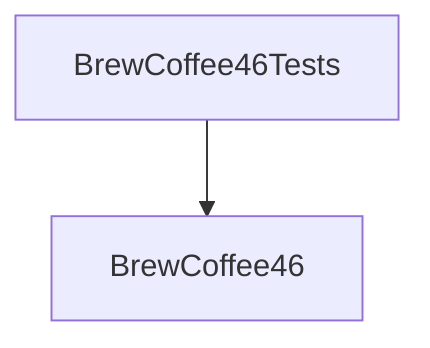
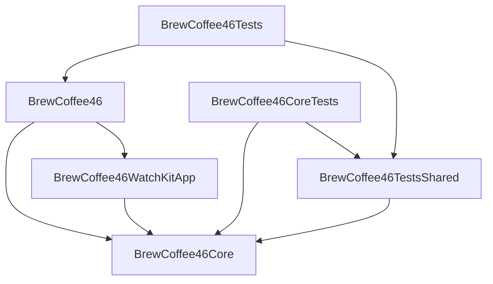

# はじめに

コーヒー抽出の方法の1つに[**4 : 6メソッド**](https://philocoffea.com/?mode=f3)という手法があり、この4 : 6メソッドを支援するiOSアプリ[**BrewCoffee46**](https://apps.apple.com/jp/app/coffeebrew46/id6449224023)を作成[^previous_article]し、この1年間で30回ほどの更新を行って少しずつ機能強化を行ってきた。
iOSDC Japan 2024 0日目のセッション[watchOS 最前線　〜現代のApple Watch向けアプリの作り方〜](https://fortee.jp/iosdc-japan-2024/proposal/ef610fc8-b241-486b-8e15-036285040cf0)でBrewCoffee46のApple Watch対応を着想し、2024/9/3に配信開始したバージョン2.0.0にてwatchOSアプリをリリースした[^iosdc2024_blog]。
この記事では、まず作成したアプリについてデモ動画などで解説し、次にiOS・watchOS両方のアプリを作るうえで行ったパッケージ構成をまとめておく。なお、iOSアプリとwatchOSアプリの両方を含めたBrewCoffee46全体のソースコードは下記のGitHubリポジトリーから入手できる。

- https://github.com/y-yu/coffeebrew46

[^previous_article]: このiOSアプリを作ったときの話を[前回の記事](https://zenn.dev/yyu/articles/c73a037d24d5a6)で書いた。
[^iosdc2024_blog]: そういうわけで（？）この記事をiOSDC Japan 2024ということにする！

::::message
**コラム**
:::details なぜコーヒーを淹れるために「4 : 6メソッド」や、それを支援するアプリが必要なのか？
コーヒーはコーヒー粉に含まれる成分を水に溶かすことで得られる液体である。コーヒー粉には、コーヒーという嗜好品として人間に好まれる成分と、しょうじきそうでもない成分がそれぞれ含まれているので、なるべくコーヒー粉に含まれる特定の好ましい成分だけを抽出してコーヒーを作りたいというモチベーションで様々な抽出方法が考案されている。
様々な抽出方法の1つに**ペーパードリップ**があり、これは紙で作られたフィルターにコーヒー粉を置き、その上からお湯をかけるというものである。コーヒー粉に含まれる成分ごとに水（お湯）への溶けやすさが異なるという点に注目して、ペーパークロマトグラフィーのように水を移動させながら溶かすことで、溶けやすさの異なる成分ごとに溶ける比率を調整できるコーヒー抽出方法である[^coffee_science]。
**4 : 6メソッド**は粕谷 哲さんによって発明されたペーパードリップの設定方法の1つであり、どのような水量・流速・回数でペーパードリップを行うとよいかを計算で求められる。発明者の粕谷さんがWorld Brewers Cup（WBrC）でチャンピオンになった[^wbrc_kasuya]というレピュテーションもあり、4 : 6メソッドを扱った本[^46method_book]が出版させるなどでコーヒーファン（？）の間で比較的有名な抽出方法である。一方で4 : 6メソッドは基本となる$コーヒー量 : 水量 = 1 : 15$とは別のコンフィギュレーションで行おうとした場合、計算が複雑になってしまう。
そこで筆者は4 : 6メソッドの計算を自動化するiOSアプリ**BrewCoffee46**をリリースし、4 : 6メソッドで許可されている表現力を最大に維持しつつも、計算はアプリが全て行うことで質量比を$コーヒー量 : 水量 = 1 : 16.5$など人間が計算するには複雑すぎる設定も可能にした。

[^coffee_science]: このあたりの詳細は[コーヒーの科学](https://www.amazon.co.jp/dp/4062579561)（Amazon）という本が詳しい。
[^wbrc_kasuya]: https://philocoffea.com/?mode=f1
[^46method_book]: [誰でも簡単！ 世界一の4：6メソッドでハマる 美味しいコーヒー](https://www.amazon.co.jp/dp/4297134039)（Amazon）
:::
::::

# watchOSアプリ版のBrewCoffee46

- App Store: https://apps.apple.com/jp/app/coffeebrew46/id6449224023

作成したwatchOSアプリは上記リンクのiOS版アプリにバンドルされて配布されている。

_watchOSアプリのトップ_

## 全体的な動作

次の動画のように、iOSアプリのコントローラーというよりはこのwatchOSアプリがスタンドアローンで動作する。

https://www.youtube.com/watch?v=6pyIxLjKDn4

上記のデモ動画であるように、watchOSアプリにも4 : 6メソッドの計算ロジックが実装されている[^46method_implementation]ため、watchOSアプリでコーヒー豆の重さを変更してそれに基づく設定を計算できる。
また、動画では説明できないが注水タイミングでApple Watchが振動する（Haptic Feedback）ようにしてあり、画面を注視しなくても注水タイミングを把握できるようになっている。これは作ったあとになって気づいたことだが、筆者はApple Watchを利き手である右手に付けており、ドリップ中は右手でお湯を注いだりする必要があるため画面を注視できない。よってHaptic Feedbackで画面を細かく見ることなく注水タイミングが把握できるようにした。

## iOSアプリとの設定共有

現状はwatchOSアプリで変更できるのはコーヒー豆の重量のみとしてあり、他の設定は下記の動画にあるようにiOSアプリから送信することにした。

https://www.youtube.com/watch?v=iKs7kAaP9f0

[^46method_implementation]: 後述するがiOSアプリとwatchOSアプリとで主要なロジックを共有できるようにSwiftPMを利用してパッケージに切り出しているため、iOSアプリとwatchOSアプリでロジックに差が生じないようにした。

# モジュール構成の変化

これまではwatchOSアプリが存在しなかったっため、iOSアプリとそのテストという下記のような2ターゲットの構成であった。

一方でwatchOSアプリが加わったため、下記のようなやや複雑な構成となった。

この図に登場するモジュールを表で整理すると次のようになる。

| モジュール                | 管理     | 目的                                                          | 
| ------------------------- | -------- | ------------------------------------------------------------- | 
| `BrewCoffee46`            | XcodeGen | iOSアプリ                                                     | 
| `BrewCoffee46Tests`       | XcodeGen | iOSアプリ部分のテスト                                         | 
| `BrewCoffee46WatchKitApp` | XcodeGen | watchOSアプリ                                                 | 
| `BrewCoffee46Core`        | SwiftPM  | iOS・watchOSの両方で共有するコアパッケージ                    | 
| `BrewCoffee46CoreTests`   | SwiftPM  | コアパッケージのテスト                                        | 
| `BrewCoffee46TestsShared` | SwiftPM  | コアパッケージのテストとiOSアプリのテストで共有するパッケージ | 

このようなiOS・watchOSアプリで共有するパッケージ管理のために**SwiftPM**を新規に導入した。これまでは[XcodeGen](https://github.com/yonaskolb/XcodeGen)を使っていたが、XcodeGenのみをつかってiOS・watchOSから参照されるフレームワークを作成することが最終的にできなかった[^help]。
共有パッケージである`BrewCoffee46Core`の設定を`Package.swift`で与えて、それをXcodeGenからローカルパッケージとして読み込むという方法であればiOS・watchOSアプリから依存できるフレームワークを簡単に作ることができた。

[^help]: 実はできるやり方があるのかもしれないが……😇

# まとめ

SwiftPMを使えばXcodeGenで`xcodeproj`ファイルを直接バージョン管理せずにiOS・watchOSの両方に対応したアプリを作成できる。実はこのwatchOSアプリの開発で一番苦労したのはiOSとの共有フレームワークをどうやって設定するかというコーディングとはまるで関係ないところであり、このようなXcodeのご機嫌をとる（？）作業の比重がプログラミングと比べて多めになってしまうのがApple系の開発で大変なところだと思う。
また、iOSDC 2024 Tokyoにはじめて参加したが、最終的にそれをきっかけにしてwatchOSアプリをリリースできたので、他にも懇親会でのディスカッションなども含めて行って本当によかったと感じている。

# 謝辞

SwiftPMを使うといったパッケージ構成などの様々な相談に乗ってくれた[@kouki_dan](https://x.com/kouki_dan)さんと[@nanashiki](https://x.com/7_6_)さんに感謝する。
